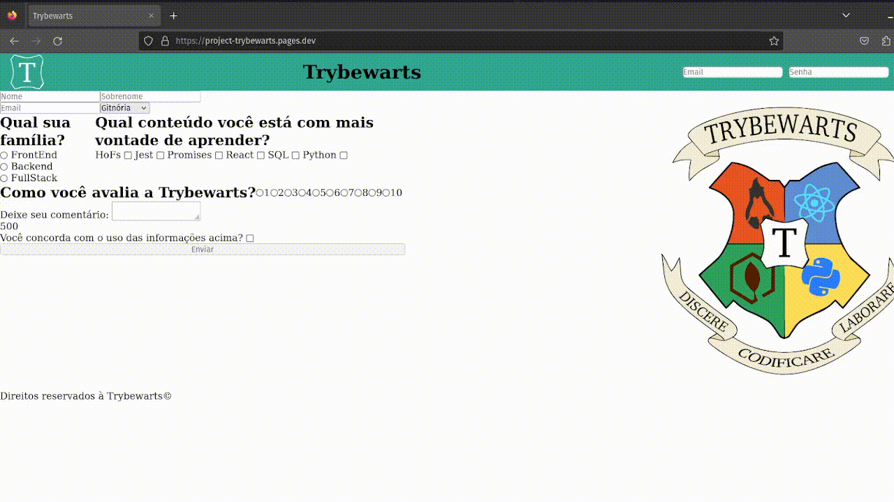

# Project Trybewarts

Este foi meu primeiro projeto em dupla, a minha dupla era  _[Erickson Siqueira](https://github.com/EricksonSiqueira)_. Neste projeto tínhamos como objetivo aprender a trabalha em dupla, fazendo pair programming. Para trabalhar neste projeto, eu e Erickson utilizamos a extensão Live Share como métedo de pair programming. O nosso site é um Hogwarts da Trybe e da programação. Você pode acessar o nosso site aqui _[Project-Trybewarts](https://project-trybewarts.pages.dev/)_.

